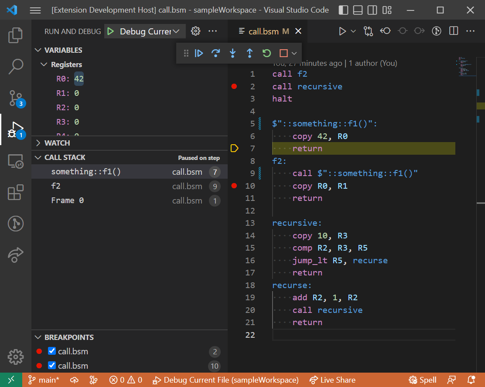

# Backseat Debug

Backseat (bslang, .bs) and Bssembler (.bsm) – debugger for Bssembler and syntax highlighting for both.

This project is still a work in progress as are the backseat language and its platforms. Debugging is only implemented for `.bsm` files so far.

## Features

* Debugging Bssembler (`.bsm`) files.
  * Stopping on breakpoints and/or on entry.
  * Stepping through application line by line.
  * Displaying register values.
  * Changing register values.
  * Displaying a call stack.
* Bssembler syntax highlighting
* Backseat (bslang) syntax highlighting

## Requirements

The debugger requires a bssembler and emulator to be able to debug `.bsm` files. For both windows/x64 binaries are packaged with the extension.

If you want to run the debugger on other platforms you can build bssembler and emulator yourself and specify their path in the `launch.json` file or in your settings. Make sure to build the emulator with debugging features (e.g. `cargo build --features debbuger`).

## Extension Settings

This extension contributes the following settings:

* `backseat-debug.bssemblerExternalPath`: Specifies an external bssembler to be used. The bssembler has to support the '-m' CLI option.
* `backseat-debug.emulatorExternalPath`: Specifies an external emulator to be used. The emulator has to support the debug interface over TCP.
* `backseat-debug.emulatorExternalPathNoGraphics`: Specifies an external emulator without graphics to be used. The emulator has to support the debug interface over TCP.
* `backseat-debug.bssemblerDefaultCommand`: Command with arguments for external bssembler that should be used if no bssemblerCommand is specified. This setting overrules `backseat-debug.bssemblerExternalPath`.
* `backseat-debug.emulatorDefaultCommand`: Command with arguments for external emulator that should be used if no emulatorCommand is specified. This setting overrules `backseat-debug.emulatorExternalPath`.
* `backseat-debug.bssemblerTimeout`: Time in milliseconds after which the bssembler is killed if it does not terminate.
* `backseat-debug.emulatorTimeout`: Time in milliseconds after which the emulator is killed if debugger cannot be connected.

## Known Issues

## Release Notes

### 0.5.x

Added Backseat Language (bslang) syntax highlighting contributed by Totto16.

### 0.4.x

Added bssembler syntax highlighting provided by coder2k (mgerhold).

### 0.3.x

Added call stack.

Moved repository to github organisation Backseating-Committee-2k.

### 0.2.x

Added registers to the variable section and added setting options.

### 0.1.x

Basic debugging support for bssembler.
